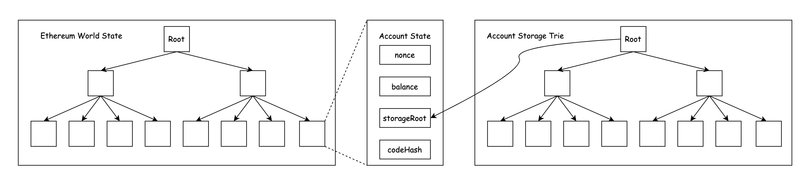
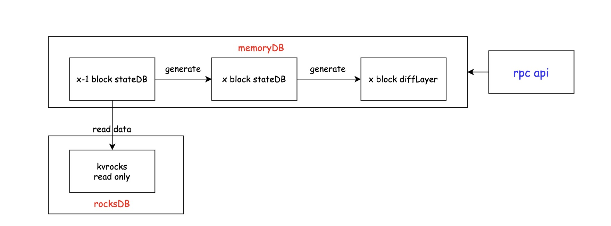

# Online debug of Blockchain DiffLayer

背景：团队里的 `Block Syncer` 程序负责将Kafka中的数据，主要是区块数据和对应的状态，写入到 `remoteDB`，remoteDB采用 `kvrocks` 进行数据存储；但是在数据同步的过程中出现了区块追块错误的情况。`Block Syncer` 追块逻辑不是将某个高度的区块数据写入 `remoteDB`，只将 `diffLayer` 数据应用到MPT中完成数据的追块逻辑，因此出现追块错误也就是通过 `diffLayer`计算出的 `rootHash` 与Kafka中某个区块的 `block header` 的 `rootHash` 不一致，无法通过 `Block Syncer` 完成追块逻辑。

## 解决措施

到八月底为止一共出现过三次追块错误的情况，出错的 `blockNumber` 分别为 `20028459, 20052893, 20207802`，推测是写入到Kafka里的业务数据有问题，因此需要写一个工具将Kafka的 `diffLayer` 数据与一个 `full node`节点获取的 `diffLayer` 数据做对比。

这里之所以只验证diffLayer是因为我们只用diffLayer进行追块逻辑，diffLayer数据结构如下所示：

```go
type DiffLayer struct {
	BlockHash common.Hash
	Number    uint64
	Receipts  Receipts
	Codes     []DiffCode
	Destructs []common.Address
	Accounts  []DiffAccount
	Storages  []DiffStorage
	DiffHash common.Hash
}

type DiffCode struct {
	Hash common.Hash
	Code []byte
}

type DiffAccount struct {
	Account common.Address
	Blob    []byte
}

type DiffStorage struct {
	Account common.Address
	Keys    []string
	Vals    [][]byte
}
```

Kafka里存储的diffLayer数据在上述结构上稍作改变，如下所示：

```go
type StateDiff struct {
	Accounts map[common.Address]hexutil.Bytes `json:"accounts"`
	Storage   map[common.Address]map[common.Hash]hexutil.Bytes `json:"storage"`
	Destructs []common.Address `json:"destructs"`
	Codes map[common.Hash]hexutil.Bytes `json:"codes"`
}
```

由此可见diffLayer数据的核心结构分别是 `Accounts, Storage, Destructs, Codes`；在验证的过程中依次使用了四种方案进行数据验证，有的方案行不通，有的方案效率较低，分别进行阐述。

### 方案一

使用的第一个解决方案是借助于 `geth` 提供的 `JSON RPC APIs` 中的  [debug_traceBlockByNumber](https://docs.nodereal.io/nodereal/meganode/api-docs/debug-api/debug_traceblockbynumber) API，该API会重放指定的blockNumber的所有交易，将包含的中间过程打印出来。

使用指定的 `HTTPEndPoint`获取出错的区块的全部结果，与Kafka中的某个指定区块的全部交易进行比对，发现结果并不完全一致，而且我们的 `Block Syncer` 程序使用的是diffLayer，因此直接比对交易详情这一方案暂时搁置。

### 方案二

仔细阅读[bsc](https://github.com/bnb-chain/bsc) 源码中diffLayer相关代码发现如果在程序启动时开启 `persistdiff` 会将geth同步数据区块过程中的diffLayer数据保存到本地文件中，而且可以通过 `GetTrustedDiffLayer` 函数将指定的blockNumber对应的diffLayer读出来，基于此我考虑可以给bsc代码增加一个 `JSON RPC API` 实现diffLayer查询功能，`GetTrustedDiffLayer` 函数实现如下所示：

```go
func (bc *BlockChain) GetTrustedDiffLayer(blockHash common.Hash) *types.DiffLayer {
	var diff *types.DiffLayer
	if cached, ok := bc.diffLayerCache.Get(blockHash); ok {
		diff = cached.(*types.DiffLayer)
		return diff
	}

	diffStore := bc.db.DiffStore()
	if diffStore != nil {
		diff = rawdb.ReadDiffLayer(diffStore, blockHash)
	}
	return diff
}
```

新增的RPC API调用方法如下所示，blockNumber为十六进制格式：

```shell
curl localhost:9545 -X POST -H "Content-Type: application/json" -d '{"jsonrpc":"2.0","method":"eth_getDiffLayer","params":["blockNumber"], "id":0}’
```

该方案经过验证可以正确拿到指定blockNumber的diffLayer，缺点是效率较低，如果要从创世区块开始数据同步，预估需要一到两个月才能到达当前出错的区块；想要借助于某个指定块开始的snapshot，发现找不到需要的，将该方案列为最后的方法。

### 方案三

以太坊其实是一个状态机，在任意时刻，只会处于一个状态中，全世界唯一的状态。我们把这个状态机，称之为以太坊世界状态，代表着以太坊网络的全局状态。

#### 世界状态

世界状态(state)由无数的账户信息组成，每个账户均存在一个唯一的账户信息。账户信息中存储着账户余额、Nonce、合约哈希、账户状态等内容，每个账户信息通过账户地址影射。 从创世状态开始，随着将交易作为输入信息，在预设协议标准（条件）下将世界态推进到下一个新的状态中。

当用户需要查询某账户余额时，将从世界状态中定位到目标账户的账户状态，便可从中查询到在现态中账户余额。当A用户转账5 ETH给B用户时，则将使得状态从 `{A: 8 ETH, B：2 ETH}` 转移到 `{A: 3 ETH, B: 7 ETH}` 状态。

交易被矿工收集到区块中的过程，就是矿工在执行状态转换的过程。即使无交易，矿工也可以直接将世界状态迁移到新状态中，比如挖出空快。

以太坊之所以有状态数据库 `StateDB`是因为区块链上的数据增长的过快，这会使得物联网设备、个人笔记本、手机等微设备无法使用以太坊客户端，会导致网络节点数量下降和影响用户使用。因此这些状态并非直接存储在区块链上，而是将这些状态维护在默克尔前缀树中，在区块链上仅记录对应的树 Root 值。使用简单的数据库来维护树的持久化内容，而这个用来维护映射的数据库叫做 StateDB。

#### 世界状态中存储的内容

首先，以太坊中有两种级别的状态，一个是顶级的世界状态，另一个是账户级的账户状态。账户状态中存储账户信息：

1. `nonce`: 这个值等于由此账户发出的交易数量，或者由这个账户所创建的合约数量(当这个账户有关联代码时)。
2. `balance`: 表示这个账户账户余额。
3. `storageRoot`: 表示保存了账户存储内容的 `MPT` 树的根节点的哈希值。
4. `codeHash`: 表示账户的 EVM 代码哈希值，当这个地址接收到一个消息调用时，这些代码会被执行; 它和其它字段不同，创建后不可更改。如果 `codeHash` 为空，则说明该账户是一个简单的外部账户，只存在 `nonce` 和 `balance`。



如上图所示，在以太坊中不止一颗默克尔树，所有账户状态通过以账户地址为键，维护在表示世界状态的树中。所有账户也存在一颗表示此账户的存储数据的树，此树是独立唯一的。

通过账户地址便可以从世界状态树中查找到该账户状态（如账户余额），如果是合约地址，还可以继续通过 `storageRoot` 从该账户存储数据树中查找对应的合约信息（如：拍卖合约中的商品信息）。

基于以上原理，结合 `Block Syncer` 中使用的是diffLayer和stateDB，diffLayer数据正是stateDB调用 `func (s *StateDB) Commit(failPostCommitFunc func(), postCommitFuncs ...func() error) (common.Hash, *types.DiffLayer, error)` 产生的；结合 `debug_traceBlockByNumber` 该API的内部实现，底层通过 `StateAtBlock(ctx context.Context, block *types.Block, reexec uint64, base *state.StateDB, checkLive, preferDisk bool) (*state.StateDB, error)` 函数产生指定区块的stateDB，实现架构如下图所示：



该方案实现起来难度较低，数据来源为kvrocks，存储为MPT数据，不存在数据同步的问题，因此效率较高，是一个理想的方案。

然而代码完成之后进行实验验证发现了一个问题，怎么都无法产生diffLayer，更进一步阅读源代码发现需要提供对应的 `snaps, *snapshot.Tree`，为其新建一个 `snaps, _ := snapshot.New(eth.chainDb, database.TrieDB(), 1, 128, current.Root(), false, true, false)` 发现依然无法产生，通过打印日志判断是哪里出现了错误 `log.Warn("Loaded snapshot journal", "diskroot", base.root, "diffs", "unmatched")`，我们使用的kvrocks中没有存储对应的snapshot数据，因此这里是无论如何也不会产生diffLayer数据的，该方案宣告失败。

### 方案四

考虑是否可以从 `debug_traceBlockByNumber` API产生的transactions数据手动生成diffLayer。
