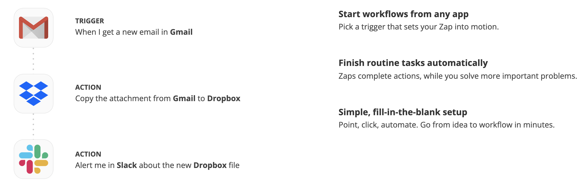
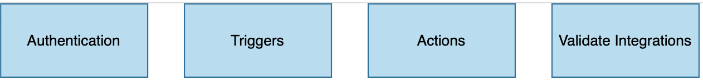
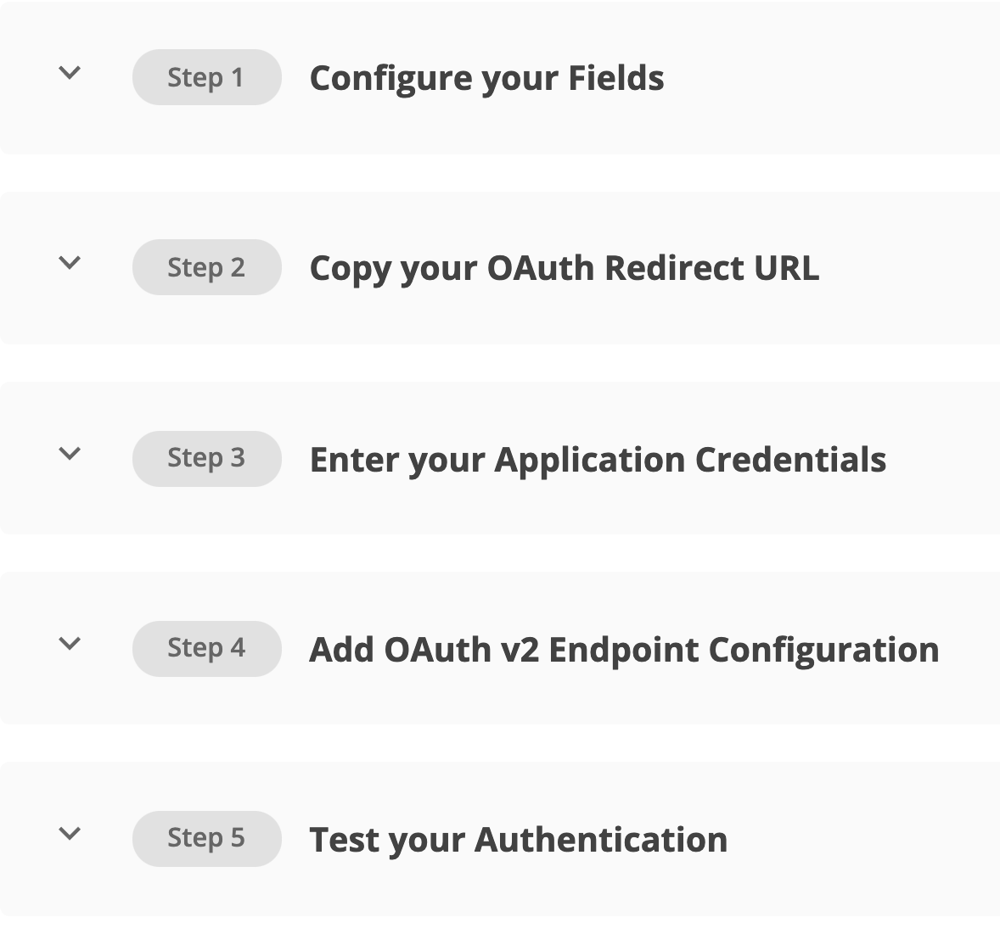
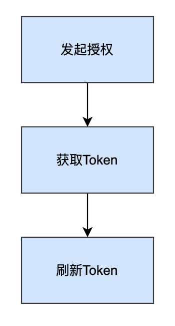
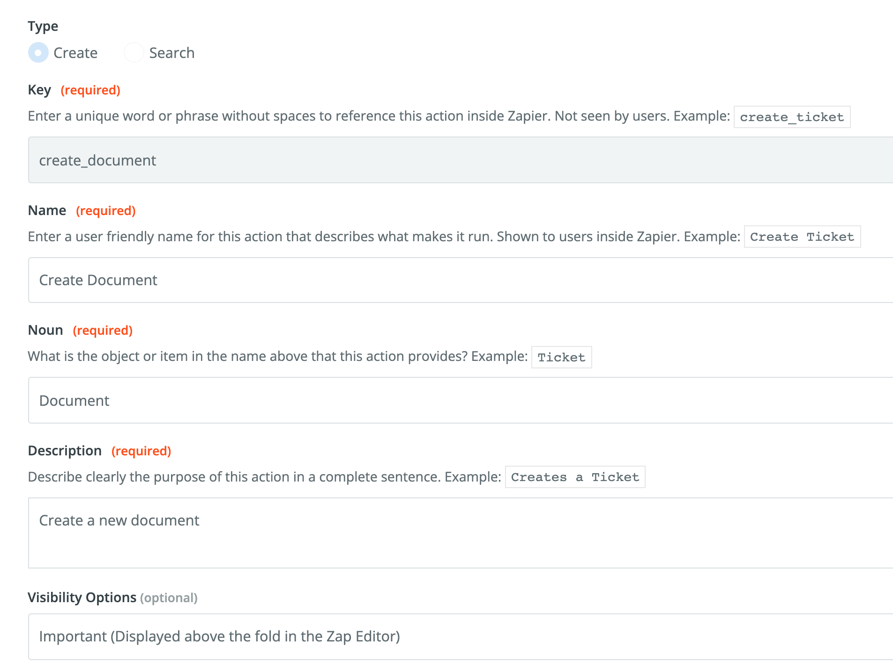
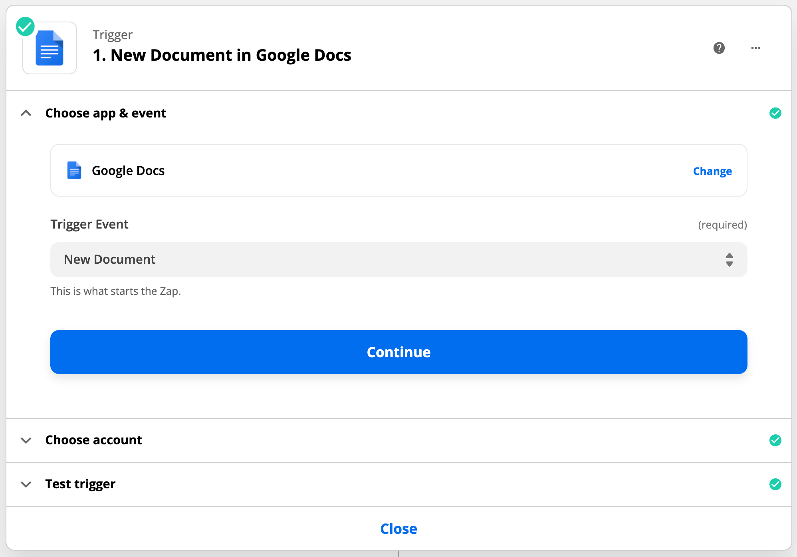
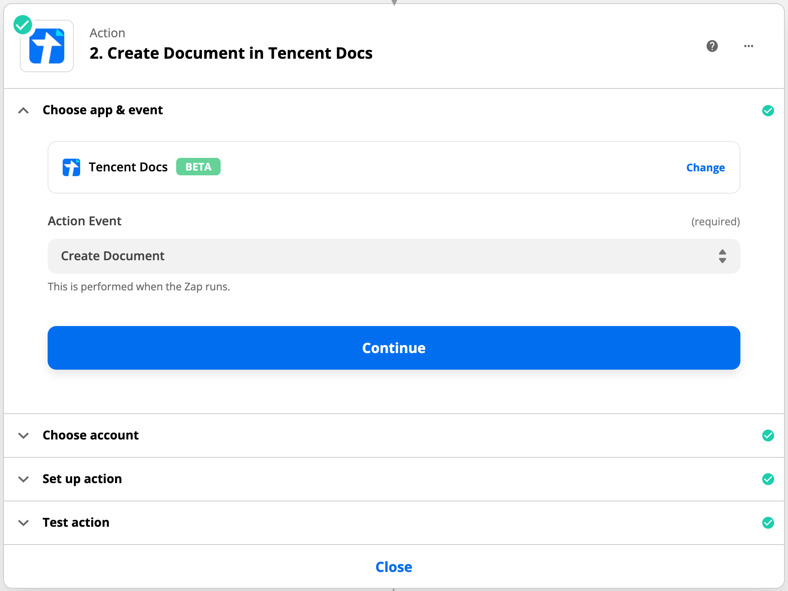
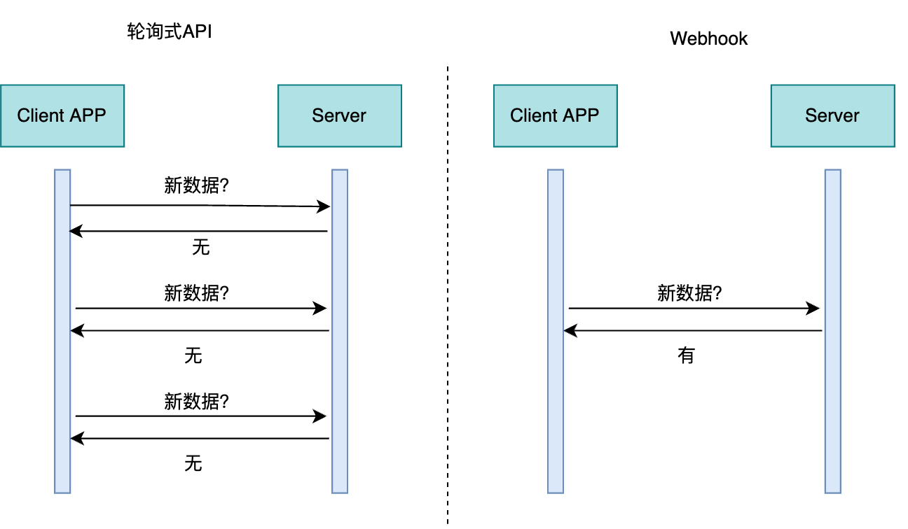

# Zapier: 无代码集成平台概述

背景：最近一段时间由于项目的需要，接触到了Zapier平台，负责将腾讯文档应用集成到Zapier平台上；Zapier是一个无代码集成平台进行对接，可以与世界上很多SaaS产品，同步数据和执行动作。在集成腾讯文档的过程中，逐渐深入了解了Zapier平台的作用，本篇文章整理了Zapier平台的使用方法和发布流程。

# 一、Zapier是什么？

假设现在有这样一个场景，一个普通用户喜欢用网盘存储文件，又喜欢在线笔记，这个用户会想如何让网盘的文件和在线笔记同步呢？对程序员来说，这不是什么大问题，可以根据网盘和在线笔记各自公开的API接口，编写程序来同步两个应用之间的数据；整个的开发过程，需要三天甚至更长时间，毕竟程序员需要研究API、编写程序、测试、部署等一系列流程。如果这个用户不是程序员呢？只好通过手动的方法来搬移数据。有没有什么更好的方法呢？

有！Zapier就是为解决这种问题诞生的，Zapier让不会编程的人也能进行应用间的集成。Zapier官网口号：

> #### Connect your apps and automate workflows
>
> ##### Easy automation for busy people. Zapier moves info between your web apps automatically, so you can focus on your most important work.

Zapier是一个无代码集成平台，可以将两个或多个APP串联，自动化执行重复性工作，使用者无需有任何代码基础，很容易的就可以实现不同APP的组合。

# 二、Zapier体系架构

 Zapier平台有三个主要的术语：

1. **Zap**：不同APP之间的自动化工作流程。
2. **Trigger**（触发器）：指APP里面的事件触发了Zap，一旦设置了Zap后，Zapier会监控APP里面的事件是否会触发Zap。
3. **Action**（行为）：指事件完成了Zap。
4. **Task**：每一个数据通过了Zap的体系，都会被记录为一个task；task很重要，Zapier有不同的付费套餐，支持的task的数量是不一样的。

一个完整的Zap如下图所示：

# 三、Zapier使用方法

了解了什么是Zapier和Zapier的三个核心概念之后，本节分为两个小节，第一小节从开发者角度讲述如何在Zapier平台制作自己的APP并进行发布；第二小节从普通用户出发如何制作一个满足自身要求的Zap。

## 1. 制作并发布App

Zapier平台支持集成用户所属公司的App，本节以腾讯文档为例进行介绍。制作流程分为四个模块，如下图所示：

### 1.1 Authentication

该模块是用来告诉Zapier平台如何使用开发者的API对用户进行认证，Zapier提供了五种认证方式：Basic Auth、Session Auth、API Key Auth、OAuth V2和Digest Auth。

腾讯文档采用OAuth2.0的授权码方式进行用户身份验证、获取用户授权，因此在Zapier平台也采用了**OAuth**的认证方式，如下图所示，一共有五个步骤：

前两步可以直接跳过，第三步要首先到腾讯文档开放平台对Zapier进行注册，获得**Client ID**和**Client Secret**；第四步是填写腾讯文档授权接口API，在这里需要填写四个API：Authorization URL、Access Token Request、Refresh Token Request、Test，其流程如下图所示：

Test API是用来在第五步测试流程正确与否。

### 1.2 Actions

该模块帮助用户将数据写入到集成的应用中，主要是通过开发者的API创建或更新数据。在集成腾讯文档的过程中，制作了一个 `Create Docuemnt` Action，意味着当触发了某个Zap设置的APP的trigger，会自动在腾讯文档中新建一个文档，文档类型和文档标题在符合要求的前提下，用户可以自行确定。

创建一个Action，需要三步：Settings、Input Desinger、API Configuration。

Settings用来设置action的一些基本信息，例如名字、描述之类的。Input Designer设置用户的输入参数。API Configuration注册实现aciton的API，如下图所示：

上图所示API能够在腾讯文档中新建一个文档。

### 1.3 Publish

集成的腾讯文档应用没有使用Trigger，因此完成Authentication和Actions之后，即可申请发布，发布成功后腾讯文档APP就可以被大家集成使用。发布的时候注意APP的logo要符合官方要求、邀请三个用户体验之后才可以完成发布，这是我在发布腾讯文档APP中遇到的两个比较棘手的问题。

## 2. 制作Zap

Zapier把自己的服务，叫做Zap。 一个Zap联接来自2个app的service。 一个service提供Trigger，一个service根据Trigger做出action。假设有这样一个场景：一个用户想把在Google Docs里的新建的文件同步到腾讯文档里面来，最简单的办法是直接复制粘贴，但是当文件数量太大的时候，人工成本太高，Zap就能够帮助用户完成这个功能。

创建一个叫做 `把Google Docs文件复制到腾讯文档`的Zap， Google Docs的Trigger是 `创建新文件`，因这个Trigger而在 腾讯文档里产生的action就是 `创建一个doc类型的文件`，这个doc文件的内容就是Google Docs里创建的新文件。

选择Trigger APP和Trigger Event，这里选择Google Docs。

选择Action APP和Action Event。

Zapier会让用户对Google Docs和Tencent Docs账户访问进行授权，存储用户认证信息。

保存这个Zap并命名，用户在Google Docs新建的文档都会同步到腾讯文档，以上是创建Zap的全过程。

# 四、Zapier原理机制

上一节用到了Google Docs和腾讯文档的Service，Zapier实现它的方式不是传统的轮询调用API方式，它采用了**Webhook**方式，当Google Docs完成新建文档任务后，会主动推送信息到Zapier的Webhook，这种情况下，用户创建的Zap才会进行相应的动作。

Webhook不同于RESTful API，**RESTful API**是请求—响应类型的API，这种API对于数据不断变化的服务，响应可能很快就会过时，要想及时获取数据的变化，开发人员需要不断轮询API，频繁的轮询又会导致服务器资源的浪费，因为大多数API调用不会返回新数据。

Zapier基于此采用了事件驱动类型API——Webhook。Webhook是一个接受HTTP POST（或GET、PUT、DELETE）的URL，实现Webhook的提供者只会在有事情发生时向配置的URL发布一条消息；不同于请求—响应API，Webhook可以实时接收更新。

# 总结

Zapier是互联网上一个很优秀的粘合剂服务，对任务流的创建和调试做了很多优化，使用起来人性化和简单，很好的支持复杂需求、满足用户想法，调试和易用性很高，提供了代码编写模式；Zapier的任务流非常适合企业或者团队中的应用。
